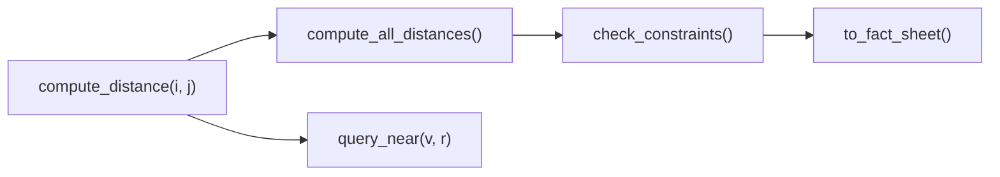

# Spatial Atlas Explained

This guide explains the Spatial Atlas poster from first principles while
preserving the boundary between implemented behavior, reported results, upstream
work, local integration, and proposed work. It is written for readers who want
more detail than the poster can hold without relying on private experiments or
unpublished diagnostics.

The companion [`POSTER_QA_PACKET.md`](POSTER_QA_PACKET.md) contains short answers
for live discussion. The companion
[`POSTER_NARRATIVE.md`](POSTER_NARRATIVE.md) contains timed speaking versions.

## 1. Read the claim label first

Every technical statement in this guide belongs to one of five evidence
classes.

| Label | Meaning |
| --- | --- |
| **Public implementation** | Behavior visible in the public Spatial Atlas source |
| **Source-reported Spatial Atlas result** | A value printed in the Spatial Atlas v2 preprint without public run artifacts sufficient for reproduction |
| **Upstream SpatialClaw result** | A mechanism or result reported by Cho and colleagues, not by Spatial Atlas |
| **Local poster-described integration** | Work described on the poster that is not present in public main |
| **Proposed** | A design target or next experiment |

These labels are not interchangeable. A deterministic calculation is not proof
that its input is correct. A completed task status is not proof that the
resulting artifact is valid. A value in a preprint is not a reproduced result
unless the matching inputs, protocol, and outputs are available.

The implementation statements in the poster preparation materials were audited
against public commit
[`d29c8c3`](https://github.com/arunshar/spatial-atlas/commit/d29c8c30a3cbf463fa120c825b3c074a3a07e923).
The subsequent public commit
[`b949dc9`](https://github.com/arunshar/spatial-atlas/commit/b949dc96ed4bdaa793b1c5eba3c97ee3d7fe7c8e)
expanded the narrative and Q&A without changing the audited implementation.

## 2. The five-year-old explanation

Imagine an AI looking at a warehouse photograph.

It may say, "The pallet is two meters from the barrier," because it has seen
many similar warehouses. That answer can sound convincing even if the AI never
measured or calculated anything.

Spatial Atlas tries to separate three jobs:

1. **Write down what appears to be present.** Make a notebook of objects,
   positions, relations, attributes, and constraints.
2. **Use a calculator where a calculation is possible.** Compute selected
   distances, nearby-object queries, and rule violations from the notebook.
3. **Ask the language model to explain the result.** Give the model the
   computed fact sheet instead of asking it to invent the same facts again.

This ordering is called **compute-grounded reasoning**, or **CGR**.

The important limitation is simple. A perfect calculator cannot repair a wrong
notebook. In public Spatial Atlas, the scene coordinates are estimated by a
language model. The arithmetic over those coordinates is repeatable, but the
coordinates are not measured geometry.

The third poster column asks how richer perception and a stateful code-action
loop could improve that boundary. It uses SpatialClaw as upstream context,
describes a local reconstructed-geometry bridge, and marks the remaining
kernel, journal, and verifier connections as proposed.

## 3. The research question

The project begins with one question:

> When an agent can compute a fact, why ask a language model to guess it?

Answer-only evaluation can tell us whether the final text matches a reference.
It often cannot tell us whether the answer came from inspected evidence,
deterministic computation, memorized patterns, or luck.

CGR changes the unit of inspection. Instead of observing only the final answer,
we can inspect:

- the entities and relations supplied to the computation
- the operation used to derive a fact
- the facts placed in the final prompt
- the state before and after a repair or refinement
- the conditions under which the system should refuse an answer

The present public implementation only realizes part of this vision. It exposes
structured state and deterministic operations, but it does not yet include a
complete evidence-use journal or a verifier that proves which facts supported
the final response.

## 4. Public architecture

**Evidence class: Public implementation**

Spatial Atlas exposes one Agent-to-Agent entry point and routes tasks to two
benchmark-oriented handlers:

- **FieldWorkArena handler:** handles multimodal spatial questions through
  vision context, a typed scene graph, deterministic graph operations, and
  language-model reasoning.
- **MLE-Bench handler:** analyzes a machine-learning task, generates runnable
  pipeline code, repairs failures, parses a pipeline-emitted validation score,
  and retains a refinement only when the parsed score improves under the
  selected direction.

The two handlers share an entry point and model-access infrastructure. They do
not prove that one algorithm generalizes across both benchmarks. Their common
idea is the ordering of work: establish state, use code for selected operations,
then generate.

Relevant public files include:

- [`src/agent.py`](../src/agent.py)
- [`src/fieldwork/handler.py`](../src/fieldwork/handler.py)
- [`src/fieldwork/spatial.py`](../src/fieldwork/spatial.py)
- [`src/fieldwork/reasoner.py`](../src/fieldwork/reasoner.py)
- [`src/mlebench/handler.py`](../src/mlebench/handler.py)
- [`src/mlebench/codegen.py`](../src/mlebench/codegen.py)
- [`src/mlebench/executor.py`](../src/mlebench/executor.py)
- [`src/entropy/engine.py`](../src/entropy/engine.py)
- [`src/cost/tracker.py`](../src/cost/tracker.py)

## 5. FieldWorkArena path

**Evidence class: Public implementation**

The public FieldWork path can be summarized as follows:

1. Parse the task question and image context.
2. Obtain a vision description, with Florence-2 detections used as context when
   available.
3. Ask a Strong-tier model for typed entities, relations, coordinates, zones,
   attributes, and constraints.
4. Build the scene graph.
5. Fill missing relation distances with deterministic two-dimensional
   Euclidean calculations.
6. Expose queries, constraint checks, and a serialized fact sheet.
7. Ask a Strong-tier model for an answer using the structured facts.
8. Ask a fast-tier model for a confidence score.
9. If the score is below 0.6, request one Strong-tier refinement.
10. Return the answer.

This path contains deterministic computation. It does not recover metric
geometry from pixels in public main.

### 5.1 Typed state

The poster writes a vertex and edge schematically as:

\[
v_i = \operatorname{SpatialEntity}
(\mathrm{id}_i,\ell_i,\mathrm{pos}_i,\mathrm{attrs}_i,z_i)
\]

\[
e_{ij} = \operatorname{SpatialRelation}
(i,p_{ij},j,d_{ij})
\]

A vertex stores one proposed entity. An edge stores a proposed relation between
two entities. The graph makes these fields inspectable and gives deterministic
code a stable input format.

For positions \(p_i=(x_i,y_i)\) and \(p_j=(x_j,y_j)\), public
`compute_distance(i, j)` applies:

\[
d(i,j)=\sqrt{(x_i-x_j)^2+(y_i-y_j)^2}
\]

The operation is deterministic for fixed coordinates. Its geometric accuracy
still depends on the coordinates supplied by extraction.

### 5.2 The five-node computation graph



The nodes have different roles:

- `compute_distance(i, j)` calculates one pairwise value from stored positions.
- `compute_all_distances()` fills missing distance fields for existing
  relations.
- `query_near(v, r)` performs an independent radius query over stored entities.
- `check_constraints()` evaluates the implemented graph constraints.
- `to_fact_sheet()` serializes entities, stored distances, and violations for
  downstream reasoning.

The graph does not recompute every distance unconditionally.
`compute_all_distances()` preserves a distance that extraction already supplied.
The current representation does not record whether a stored distance came from
the extractor or from `compute_distance`.

### 5.3 What the graph establishes

The graph establishes a visible boundary between:

- model-proposed scene evidence
- deterministic derivation over that evidence
- final language generation

That boundary is useful for inspection and targeted testing. It does not prove
that the scene evidence is physically correct.

### 5.4 What the graph does not establish

Public main does not establish any of the following:

- metric scale recovered from the image
- measured three-dimensional geometry
- uncertainty intervals for a reported distance
- provenance distinguishing supplied and derived relation distances
- a fail-closed policy for missing safety attributes
- proof that the final answer used a particular graph fact

One especially important limit is missing evidence. Public
`check_constraints()` treats absent PPE, hard-hat, and safety-vest attributes as
compliant defaults. Missing evidence can therefore suppress a violation. A
safety-oriented deployment should represent absence as unknown and refuse the
claim when required evidence is unavailable.

## 6. Entropy-guided reasoning

This section contains two different evidence classes. The equations are the
paper formulation. The one-refine controller is the public implementation.

### 6.1 Paper formulation

**Evidence class: Source-reported Spatial Atlas theory**

At step \(t\), the paper represents accumulated observations, computed facts,
and intermediate conclusions as a knowledge state \(\mathcal K_t\). It defines
answer entropy as:

\[
H(\mathcal A\mid\mathcal K_t)
=-\sum_{a\in\mathcal A}
P(a\mid\mathcal K_t)\log P(a\mid\mathcal K_t)
\]

Given candidate actions \(c_j\), it then proposes choosing the action with the
greatest expected entropy reduction:

\[
c^\star=\arg\max_{c_j}
\mathbb E\left[
H(\mathcal A\mid\mathcal K_t)
-H(\mathcal A\mid\mathcal K_t\cup\operatorname{obs}(c_j))
\right]
\]

The reflection rule is written as:

\[
\operatorname{reflect}(a)=
\begin{cases}
\text{True}, & \sigma(a)<\tau\\
\text{False}, & \text{otherwise}
\end{cases}
\]

with \(\tau=0.6\).

The full paper policy also describes Fast, Standard, and Strong routing with at
most two reflection rounds. These equations state the intended decision
objective. They are not the algorithm executed by the current FieldWork path.

### 6.2 Public controller

**Evidence class: Public implementation**

The deployed public sequence is narrower:

```text
answer = Strong(question, evidence)
score = FastSelfGrade(answer, evidence, question)

if score < 0.6:
    answer = StrongRefine(answer, evidence, question)

return answer
```

This means:

- one Strong-tier answer
- one fast-tier self-grade
- at most one Strong-tier refinement
- no expected-information-gain calculation
- no demonstrated calibration of the self-grade

If the grading response cannot be parsed, the code returns 0.5. The repository
contains no reliability curve or threshold sweep supporting 0.6 as a calibrated
operating point. The score should therefore be described as a routing heuristic,
not a probability of correctness.

## 7. MLE-Bench path

**Evidence class: Public implementation**

The MLE handler applies the compute-first idea to a different object: generated
pipeline execution and a parsed validation score.

A simplified flow is:

1. Analyze the competition description and infer task structure.
2. Generate pipeline code with a strategy-specific prompt.
3. Run the code as a subprocess with a timeout.
4. Use captured error context to request a repair when execution fails.
5. Parse `VALIDATION_SCORE` from a successful run.
6. Request up to two score-driven refinements after a successful initial run.
7. Keep a refinement only when its parsed score improves under the selected
   direction.
8. Produce the selected submission.

Public default configuration permits three initial execution attempts in total.
The handler checks a 900-second refinement budget before starting an iteration.
A started iteration can continue under its separate 600-second subprocess
timeout, so 900 seconds is not a strict end-to-end deadline.

### 7.1 What score-gated rollback guarantees

The rollback rule guarantees monotonicity only for the parsed
`VALIDATION_SCORE`, under an analyzer-supplied direction interpreted through a
keyword heuristic.

It does not prove improvement on a hidden benchmark. The score is produced by
model-generated code, so its reliability depends on the generated validation
procedure.

### 7.2 Public safety and validity limits

The public executor provides a subprocess and timeout. It is not a complete
security sandbox.

The code-generation prompt can instruct a generated pipeline to check:

- ID overlap
- row fingerprints
- temporal ordering
- byte-identical media

These are prompt-specified safeguards. Public main does not independently
enforce the audit or verify the validity of the split.

The poster describes explicit execution opt-in, isolated-worker attestation, and
opt-in dummy fallback. Those hardened controls are not present in public main.
After all initial attempts fail, public main automatically creates a dummy
submission.

The configured token field supports accounting. The active execution path does
not use it as a hard admission gate.

## 8. Source-reported evaluation

**Evidence class: Source-reported Spatial Atlas results**

The following values are transcribed from the Spatial Atlas v2 preprint. The
public repository contains the manuscript tables, but it does not contain the
sealed task-level artifacts, frozen run manifest, repeated-run evidence, or
matching current pipeline needed to reproduce them.

### 8.1 FieldWorkArena

| Configuration | Factory | Warehouse | Retail |
| --- | ---: | ---: | ---: |
| Overall | 72 | 68 | 74 |
| w/o Spatial Scene Graph | 51 | 44 | 55 |
| w/o Entropy-Guided Reasoning | 65 | 60 | 67 |
| w/o Florence-2 | 63 | 58 | 66 |
| GPT-4V Direct | 48 | 41 | 52 |

The reported difference between Overall and the no-scene-graph row is 21, 24,
and 19 points across the three displayed environments.

That comparison is consistent with the CGR hypothesis, but it does not isolate
geometric correctness. Removing the graph can also change prompt structure,
token allocation, intermediate representation, and the information shown to the
final model.

A stronger control would keep the schema and prompt length fixed while
corrupting only the geometry. The current public package does not report that
control.

The source also does not provide per-environment task counts, confidence
intervals, or repeated-run variance. The three columns should not be described
as independent replications.

### 8.2 MLE-Bench

| Category | Valid (%) | Medal (%) | Competitions |
| --- | ---: | ---: | ---: |
| Tabular | 91 | 42 | 32 |
| NLP | 78 | 28 | 18 |
| Vision | 65 | 15 | 12 |
| Time Series | 85 | 35 | 8 |
| Other | 72 | 20 | 5 |
| **Overall** | **82** | **32** | **75** |

The displayed category counts sum to 75. Weighted means of the displayed,
rounded category rates round to the displayed Overall rates:

\[
\frac{91(32)+78(18)+65(12)+85(8)+72(5)}{75}
=81.81
\]

\[
\frac{42(32)+28(18)+15(12)+35(8)+20(5)}{75}
=32.11
\]

This is an arithmetic consistency check only. It does not recover raw outcome
counts, repeated attempts, hidden denominators, variance, confidence intervals,
or the aggregation protocol used by the source.

## 9. Why SpatialClaw appears

### 9.1 Upstream mechanism

**Evidence class: Upstream SpatialClaw**

SpatialClaw is a separate project by Cho and colleagues. It treats code as an
action interface. Its agent writes one AST-checked Python cell at each step into
a persistent Jupyter kernel, observes intermediate outputs, and can compose,
recompute, or revise operations before returning an answer.

SpatialClaw also exposes wrappers around SAM3, Depth-Anything-3, and geometry
utilities. The underlying perception models have their own authors and
licenses. Attribution to SpatialClaw concerns its action interface, framework,
and wrappers.

### 9.2 Upstream results

**Evidence class: Upstream SpatialClaw result**

The SpatialClaw paper reports:

- 59.9 percent average accuracy across 20 spatial reasoning benchmarks
- an 11.2-point improvement over the prior best spatial agent

These are SpatialClaw results. They are not Spatial Atlas results and should not
be compared directly with the two Spatial Atlas preprint tables.

## 10. Local poster-described metric bridge

**Evidence class: Local poster-described integration**

The poster describes a local bridge that replaces model-estimated
two-dimensional scene coordinates with evidence derived from object masks and a
reconstructed point map.

The described sequence is:

1. Obtain object masks and a reconstructed point map.
2. Erode masks to reduce boundary contamination.
3. Keep finite points that satisfy a confidence requirement.
4. Build deterministic horizontal XZ voxel representatives.
5. Compute directed nearest-neighbor fifth percentiles in both directions.
6. Take the smaller directed value as a surface-gap estimate.
7. Validate range, provenance, protocol contracts, and evidence hashes before
   returning the value.

For reconstructed object point sets \(A\) and \(B\), the poster writes:

\[
d_{A\rightarrow B}
=Q_{0.05}\left(
\left\{
\min_{b\in B}\lVert a-b\rVert_{XZ}:a\in A
\right\}
\right)
\]

\[
\hat d(A,B)=\min(d_{A\rightarrow B},d_{B\rightarrow A})
\]

The fifth percentile reduces sensitivity to a single stray point. It does not
solve occlusion, recover unseen surfaces, or turn reconstructed depth into
physical ground truth.

The bridge estimates clearance between visible reconstructed surfaces. Mask,
depth, scale, visibility, and reconstruction errors can propagate into the
reported value. A safety-oriented system should expose coverage and uncertainty
and refuse a claim when the required surfaces are not observed.

This bridge is described on the poster but is absent from public main. The
public repository therefore cannot demonstrate the local implementation or its
experimental behavior.

## 11. Proposed integration

**Evidence class: Proposed**

The complete Figure 2 path is not deployed end to end. Three connections remain
proposed:

1. **Persistent action loop:** connect Atlas evidence state to a kernel where
   the agent can inspect, compose, recompute, and revise operations.
2. **Evidence-use journal:** record the exact facts and tool outputs consumed by
   each answer.
3. **Verifier contract:** count an answer only when its evidence is fresh,
   valid, and attested.

These components would make the CGR claim testable at the answer boundary. A
fact sheet in a prompt is not enough to prove that the model used the fact.

## 12. What the poster contributes

The strongest defensible public contribution is the typed, inspectable
computation boundary:

- a two-handler Agent-to-Agent server
- a typed scene graph
- deterministic graph operations
- fact-sheet serialization
- a confidence-gated FieldWork refinement path
- MLE pipeline repair and score parsing
- score-gated rollback on a pipeline-emitted validation proxy

The contribution is not that Spatial Atlas has solved geometric perception. It
is that the system identifies where evidence enters, where code derives a fact,
and where language generation begins.

## 13. What remains unresolved

The main open questions are:

1. Does correct geometry help when schema, prompt structure, and token budget are
   held fixed?
2. How should uncertainty and missing evidence propagate through graph queries
   and constraints?
3. Can a metric bridge refuse unsupported clearance questions reliably?
4. Which validation evidence makes a generated MLE score trustworthy?
5. Can an evidence journal prove which facts the final answer consumed?
6. Can a verifier reject stale, invalid, or unattested evidence before scoring?

The most informative next FieldWork experiment is a schema-matched corruption
control. Keep the graph format and final prompt fixed. Change only the
correctness of the geometric values. This separates the benefit of structured
prompting from the benefit of accurate computation.

## 14. Claim-boundary checklist

### Safe as public implementation

- Public Spatial Atlas routes to FieldWorkArena and MLE-Bench handlers.
- Public FieldWork builds a typed scene graph.
- Public graph code computes selected two-dimensional Euclidean distances.
- Public graph code supports radius queries, constraint checks, and fact-sheet
  serialization.
- Public FieldWork performs one answer, one self-grade, and at most one
  refinement below 0.6.
- Public MLE code repairs failures, parses `VALIDATION_SCORE`, and retains an
  improving parsed score.

### State only as source-reported Spatial Atlas results

- FieldWorkArena values in the displayed preprint table.
- MLE-Bench values in the displayed preprint table.
- Any paper claim about the contribution of an ablated component.
- The full entropy and progressive model-routing policy.

### Attribute to upstream SpatialClaw

- The persistent AST-checked Python action loop.
- SpatialClaw perception and geometry wrappers.
- 59.9 percent average accuracy across 20 benchmarks.
- The 11.2-point improvement over the prior best spatial agent.

### State only as local poster-described integration

- The mask erosion, point filtering, XZ voxelization, symmetric
  fifth-percentile surface-gap estimator, and strict bridge validation.

### State only as proposed

- The end-to-end persistent-kernel connection.
- The evidence-use journal.
- The post-kernel verifier.

### Do not claim

- The public repository reproduces either result table.
- Model-estimated two-dimensional coordinates are measured geometry.
- The graph recomputes every supplied relation distance.
- The FieldWork self-grade is calibrated.
- Public MLE execution is a complete sandbox.
- Prompted leak checks are an independently enforced audit.
- Figure 2 is deployed end to end.
- SpatialClaw results belong to Spatial Atlas.
- A missing cost, latency, uncertainty, or refusal value can be estimated from
  the poster.

## 15. Public source index

- [Spatial Atlas repository](https://github.com/arunshar/spatial-atlas)
- [Spatial Atlas v2 preprint](https://arxiv.org/abs/2604.12102v2)
- [Spatial Atlas poster PDF](spatial_atlas_poster.pdf)
- [Spatial Atlas poster source](spatial_atlas_poster.tex)
- [Poster narrative](POSTER_NARRATIVE.md)
- [Poster Q&A packet](POSTER_QA_PACKET.md)
- [SpatialClaw repository](https://github.com/NVlabs/SpatialClaw)
- [SpatialClaw paper](https://arxiv.org/abs/2606.13673)

## 16. One-sentence take-away

Spatial Atlas makes an agent’s evidence and deterministic work more visible
before language generation, while the poster explicitly separates that public
implementation from source-reported results, upstream SpatialClaw, a local
metric bridge, and the proposed verifier path.
